# SOSRWIS - 户外雪景渲染与天气交互系统
**(Snowy Outdoor Scene Rendering & Weather Interaction System)**

  

SOSRWIS 是一个基于 **OpenGL 3.3 Core Profile** 开发的沉浸式户外场景漫游引擎。本项目实现了多光源光照模型、实时阴影映射、动态昼夜循环以及基于粒子系统的降雪特效，旨在模拟真实的冬季村庄氛围。

---

## 🛠️ 项目特性

*   **动态昼夜循环**：基于物理轨迹的太阳/月亮运动，伴随天空盒与环境光颜色的实时插值。
*   **实时阴影**：实现了 Two-pass 阴影渲染，并解决了阴影痤疮与悬浮问题。
*   **多光源系统**：支持定向光（太阳/月亮）与点光源（路灯）的混合渲染。
*   **粒子降雪特效**：基于 Billboard 技术的高性能粒子系统，模拟雪花飞舞。
*   **双模式漫游**：支持 FPS（第一人称行走）与 God Mode（上帝视角）无缝切换。
*   **物理碰撞检测**：基于 AABB 的空气墙阻挡机制。
*   **工程化架构**：模块化的 Core/Renderer/Scene 分层设计，支持 glTF/OBJ 模型加载。

---

## 🚀 快速开始 (构建指南)

本项目使用 **CMake** 进行构建，推荐使用 **Visual Studio 2022** 进行开发与运行。

### 1. 克隆仓库 (Clone)

**⚠️ 注意：** 本项目包含大量模型与静态库文件，使用了 Git LFS。请务必在克隆前安装并初始化 LFS。

> GitHub 服务器上存储的实际上不是那个几百 MB 的 .lib 文件，而是一个只有几行字的**纯文本“指针文件”**（大约 1KB），里面记录了真实文件的下载地址和哈希值。
>
> * 注意：请勿直接下载 .ZIP 压缩包使用该项目，因为 GitHub 的打包机制**不支持**自动解析 LFS。它会把那个几行字的“文本指针”下载下来，改名为 .lib 塞进压缩包里。从而最终只能在 `SOSRWIS/third_party/lib` 目录下看到很多大小为 1KB 的 .lib 文件

```bash
# 1. 初始化 LFS (仅需执行一次)
git lfs install

# 2. 克隆仓库
git clone https://github.com/Miraitowa-XF/SOSRWIS.git
```

⚠️ **一定要做**：克隆完成后请务必查看，上面个提到的目录底下是否包含完整的 .lib 文件，如果不完整请使用如下的方式手动强制拉取 LFS 文件：

```bash
# 进入你克隆下来的项目目录：
cd SOSRWIS

# 执行核心修复命令,手动强制拉取 LFS 文件：
git lfs pull
```

通过上述步骤一般可以解决克隆项目不完整的问题。

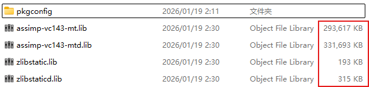

### 2. 环境依赖

*   **操作系统**: Windows 10/11 
*   **编译器**: MSVC (Visual Studio 2022)
*   **构建工具**: CMake 3.12+
*   **显卡驱动**: 支持 OpenGL 3.3+

### 3. 编译与构建

#### 方式 A：使用 Visual Studio (推荐)
1. 打开 Visual Studio 2022。

2. 选择 **"打开本地文件夹" (Open a local folder)**。

3. 选择克隆下来的项目根目录。

4.  ~~等待 Visual Studio 自动检测 `CMakeLists.txt` 并完成配置（输出窗口显示 `CMake generation finished`）。~~

   因为本项目使用到嵌套 `CMakeLists.txt` 因此 VS 不会自动完成配置，请按照下述操作来进行配置：

   * 克隆完成后会出现如下所示的提示框，请点击 “**启用和设置源目录**”：

     

   * 找到根目录下的 `CMakeLists.txt` 文件，并打开，具体目录是 `SOSRWIS/CMakeLists.txt`：

     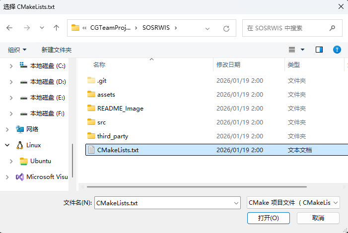

   * ⚠️ **若错过此步或者不小心点到“不启用”**：请执行如下的操作

     * **手动配置CMake**：找到项目的根目录鼠标右键找到“**CMake 工作区设置**”

       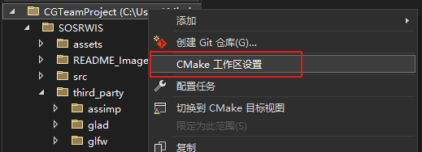

     * **启用CMake:**

       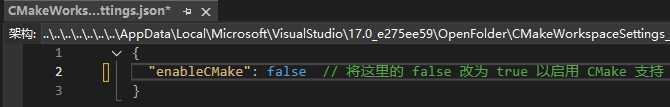

5. 在顶部工具栏的 **"启动项"** 下拉菜单中，可以看到生成的 `.exe` 目标。

   

#### 方式 B：使用命令行
```bash
mkdir build
cd build
cmake ..
cmake --build .
```

---

## 📂 项目结构说明

为了保证代码的可维护性，项目采用了分层架构设计：

```text
SOSRWIS/
├── CMakeLists.txt       # 根构建脚本
├── main.cpp             # 【核心入口】主程序逻辑与渲染循环
├── test.cpp             # 【测试入口】环境自检单元测试
├── src/
│   ├── Core/            # [核心层] 摄像机、窗口回调、碰撞检测算法
│   ├── Renderer/        # [渲染层] 模型加载(Assimp)、网格、天空盒、着色器类
│   └── Scene/           # [场景层] 粒子系统、太阳系统、场景对象管理
└── assets/              # [资源目录] 
    ├── models/          # .gltf / .obj 模型文件
    ├── shaders/         # .vert / .frag 着色器脚本
    └── textures/        # 纹理贴图与天空盒 CubeMap
```

---

## ▶️ 如何运行 (Run)

本项目编译后会生成两个独立的可执行文件，请根据需求选择运行：

### 1. 主程序：`glMain.exe` (或 `glStudy.exe`)
*   **作用**：这是项目的**完整演示程序**。包含所有的场景渲染、漫游交互、光影特效。
*   **如何运行**：在 VS 顶部启动项选择 `glMain.exe`，点击绿色的“播放”按钮。

### 2. 测试程序：`glTest.exe`
*   **作用**：这是一个**环境自检工具**。用于在不加载庞大场景的情况下，快速检测 OpenGL 环境、数学库 (GLM)、模型加载库 (Assimp) 是否链接正常。
*   **如何运行**：在 VS 顶部启动项选择 `glTest.exe` 并运行。如果控制台输出全 `[OK]`，说明开发环境配置无误。

---

## 🎮 操作说明与效果展示

### 1. 漫游与交互
*   **WASD**：前后左右移动。
*   **TAB**：**切换漫游模式**。
    *   **FPS 模式 (默认)**：模拟重力，贴地行走，有碰撞体积。
    *   **God Mode (上帝模式)**：自由飞行，无视碰撞，方便俯瞰全景。
*   **Space / Left Ctrl**：垂直上升 / 下降 (仅在上帝模式有效)。
*   **Left Alt**：**解锁/锁定鼠标光标** (方便移动窗口或查看控制台)。

### 2. 动态环境控制
*   **L**：**开启/关闭路灯** (多光源演示)。
*   **O / P**：**开启/关闭下雪** (粒子系统演示)。
*   **键盘方向键 ← / →**：**手动调节时间**。
    *   按住 `→` 加速时间流逝，观察日落月升。
    *   按住 `←` 时间倒流。

### 3. 效果截图

整体效果如下图所示：
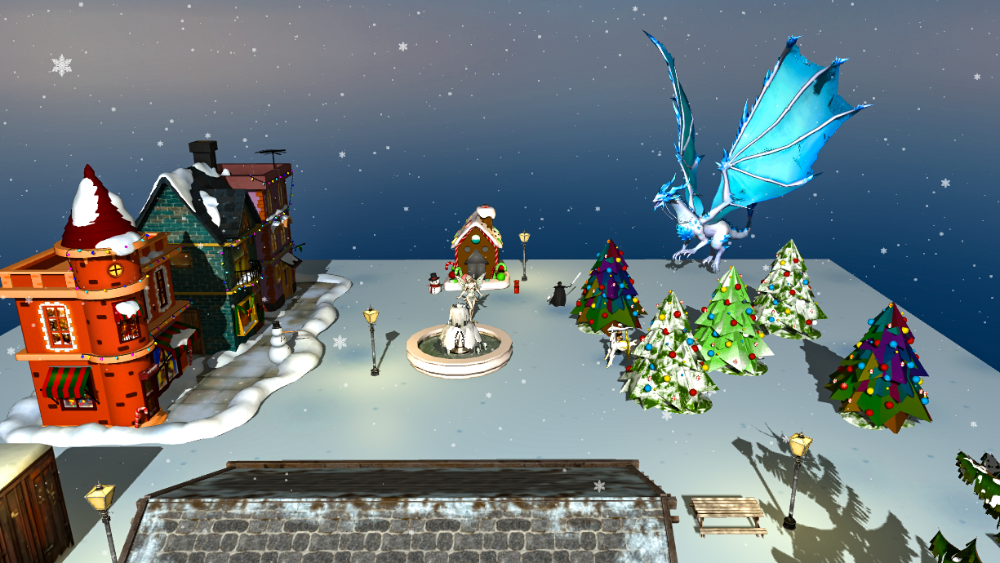

#### 🌤️ 动态昼夜与阴影
> *通过调节时间，观察太阳东升西落，以及实时动态阴影的变化。*

|          正午 (Noon)           |             黄昏 (Sunset)             |
| :----------------------------: | :-----------------------------------: |
| 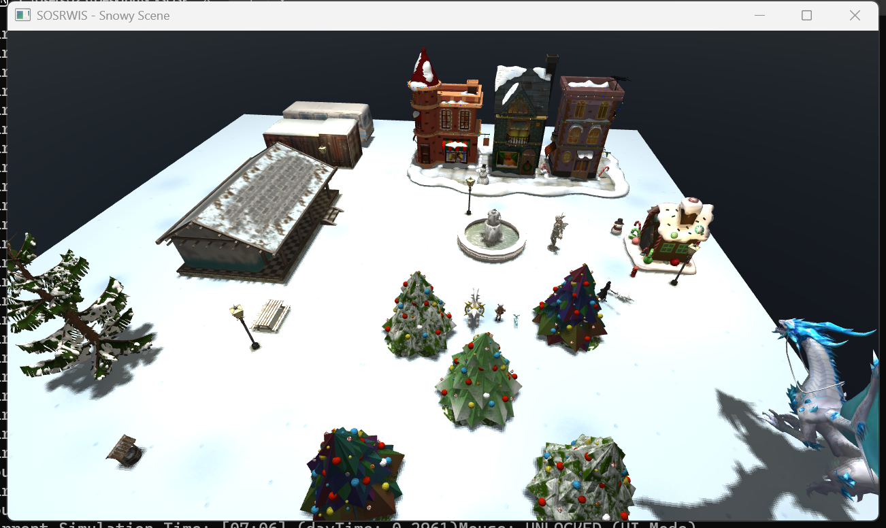 | 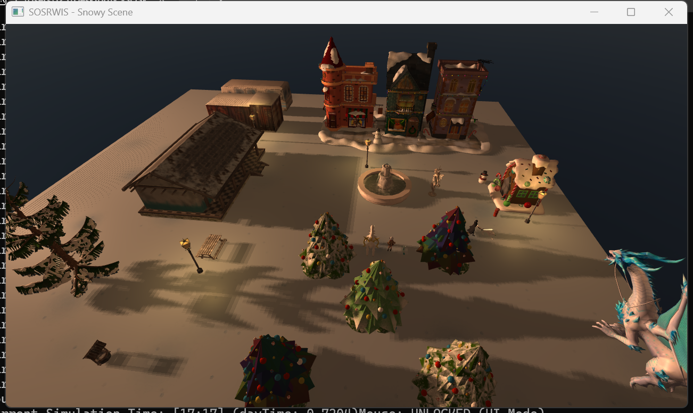 |

#### 🌙 夜景与多光源系统
> *夜晚模式下，环境光变暗。按下 **L** 键开启路灯，体验点光源与月光的混合光照。*

|             路灯关闭              |              路灯开启              |
| :-------------------------------: | :--------------------------------: |
| 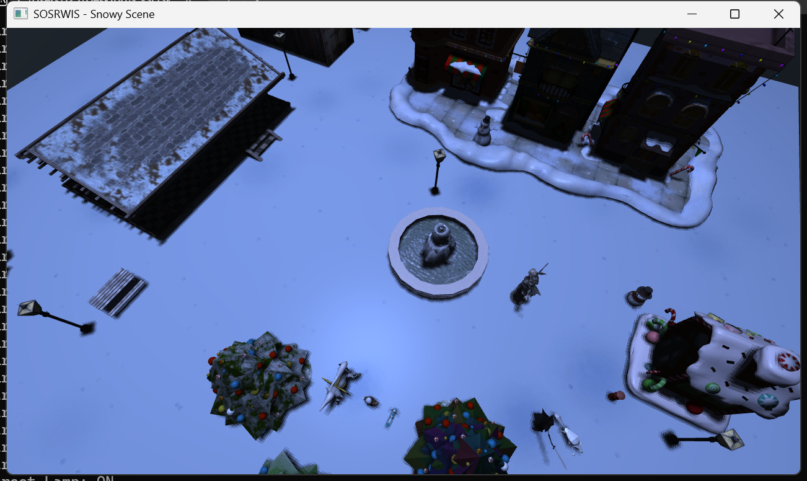 | 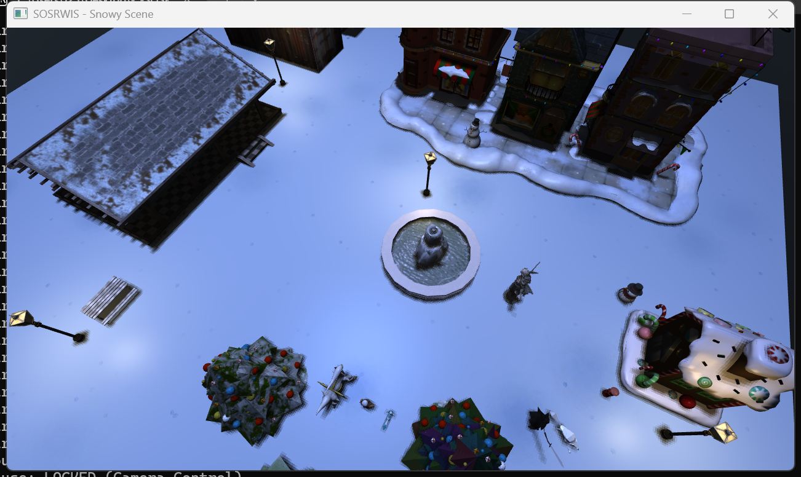 |

#### ❄️ 粒子降雪特效
> *按下 相应的键开启降雪，观察基于 Billboard 技术的雪花飞舞效果。*

* **小雪（竖直下落）：K键**

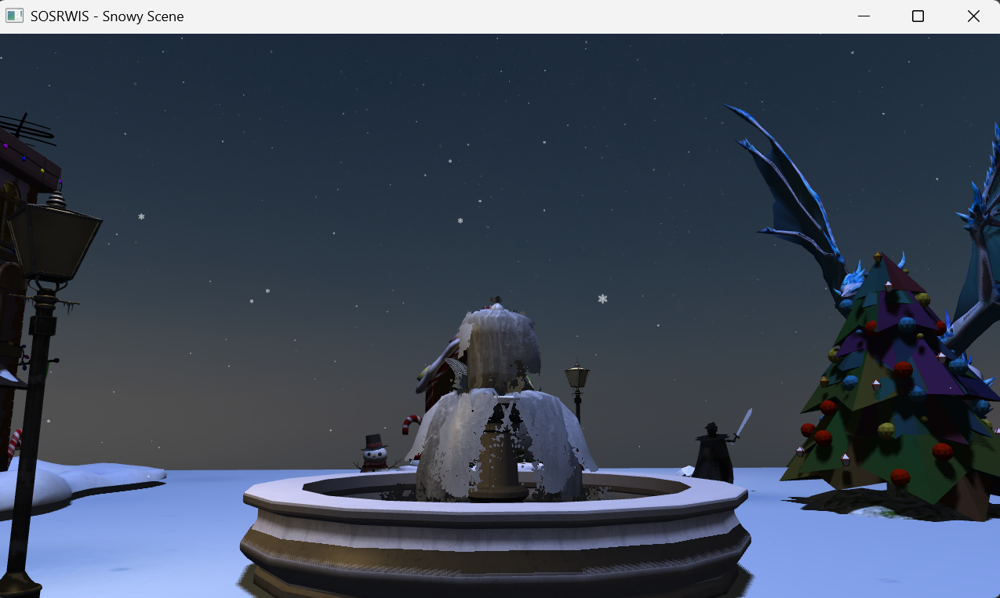

* **中雪（随风飞舞）：O键**

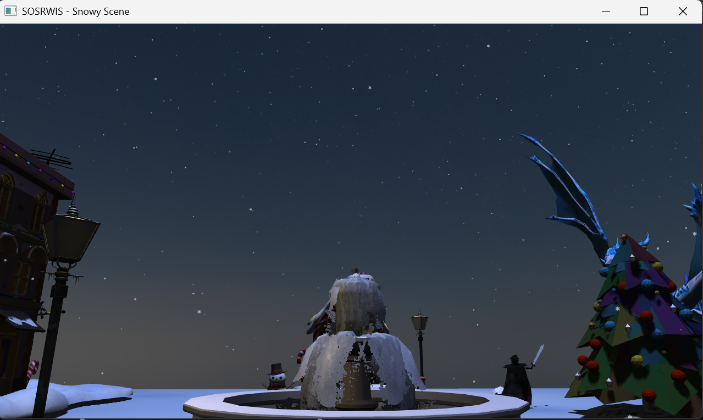

* **大雪（纷飞效果）：L键**

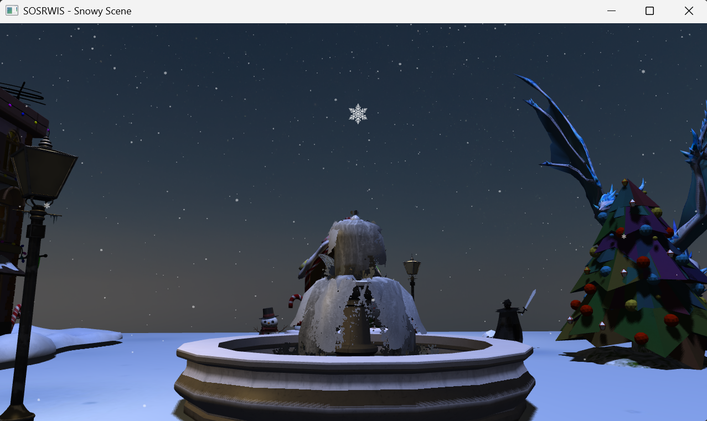
